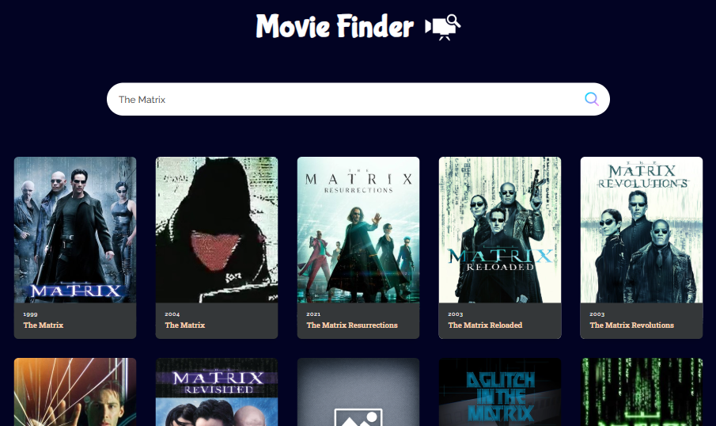

# 🎬 Movie Finder App

Aplicação web desenvolvida com **React** que permite buscar filmes e visualizar informações básicas utilizando a **API pública do The Movie Database (TMDB)**.

O projeto foi criado com foco em aprendizado de React, consumo de APIs REST e gerenciamento de estado em aplicações frontend modernas.

---

## 🚀 Funcionalidades

- Busca de filmes por título
- Exibição de resultados em formato de cards
- Exibição de:
  - Título do filme
  - Ano de lançamento
  - Poster (com imagem fallback quando indisponível)
  - Sinopse
- Mensagem orientativa antes da primeira busca
- Mensagem de aviso quando nenhum resultado é encontrado
- Indicador de carregamento durante a busca
- Interface simples e responsiva

---

## 🛠️ Tecnologias Utilizadas

- **React** — Construção da interface
- **JavaScript (ES6+)** — Lógica da aplicação
- **Vite** — Ambiente de desenvolvimento
- **TMDB API** — Fonte dos dados dos filmes
- **HTML5 & CSS3** — Estrutura e estilização

---

## 📂 Estrutura do Projeto

```text
src/
├── assets/
│   ├── logo1.png
│   ├── search-icon.png
│   ├── netflix-backgorund.jpg
│   ├── no-image.png
│   └── react.svg
├── App.jsx
├── App.css
├── MovieCard.jsx
├── main.jsx
└── index.css
```
## ▶️ Como Executar o Projeto

1. Clone este repositório:
   ```bash
   git clone https://github.com/gustavo-security/Movie-Finder-App-React.git
    ```
2. Acesse a pasta do projeto:
    ```bash
    cd Movie-Finder-App-React
    ```
3. Instale as dependências:
    ```bash
    npm install
    ```
4.  Execute o projeto:
    ```bash
    npm run dev
    ```
5.  Acesse no navegador:
    ```bash
    http://localhost:5173
    ```

## 🧠 Conceitos Praticados
- Componentização no React
- Uso de useState para controle de estado
- Consumo de API REST com fetch
- Renderização condicional
- Tratamento de estados de loading e vazio
- Organização de arquivos em projeto React
  
## 📸 Preview

<p align="center">
  
</p>

## 📌 Status do Projeto

✔️ Funcional<br>
🚧 Em evolução

## Próximas melhorias planejadas
- Opção de filtragem de resuldados
- Página de detalhes do filme
- Paginação de resultados
- Melhorias de UI/UX
- Tratamento de erros de requisição

## 👤 Autor

**Gustavo Sales**<br>
Estudante de Ciência da Computação
